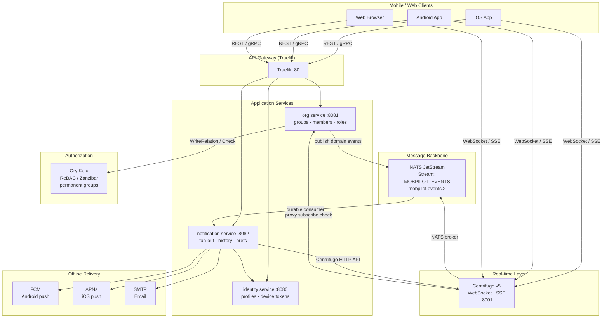
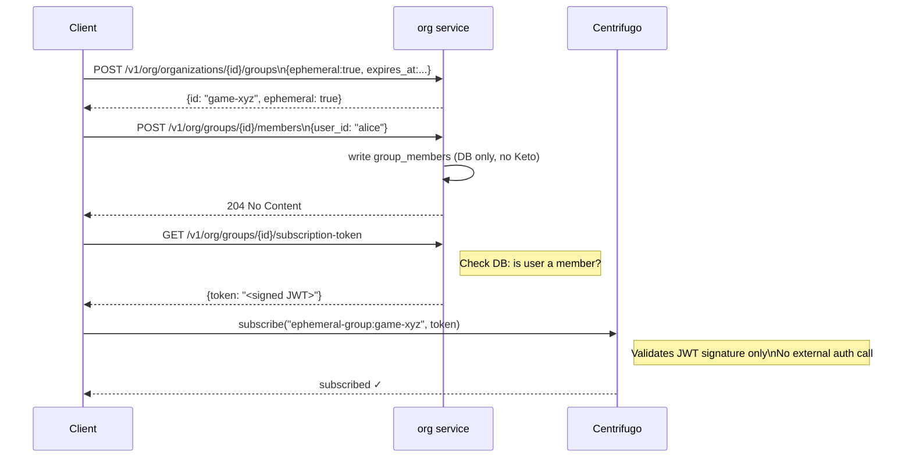
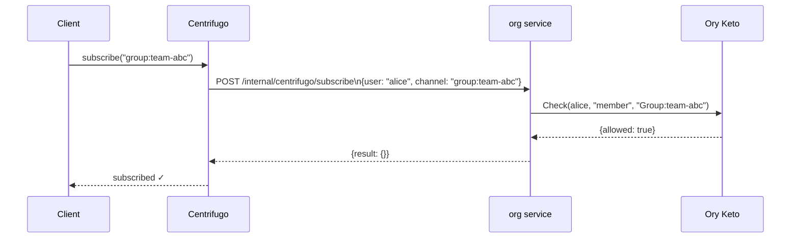
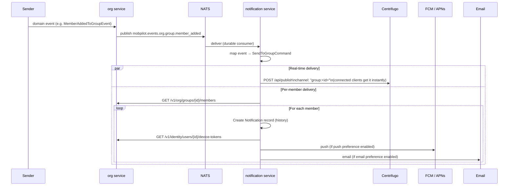
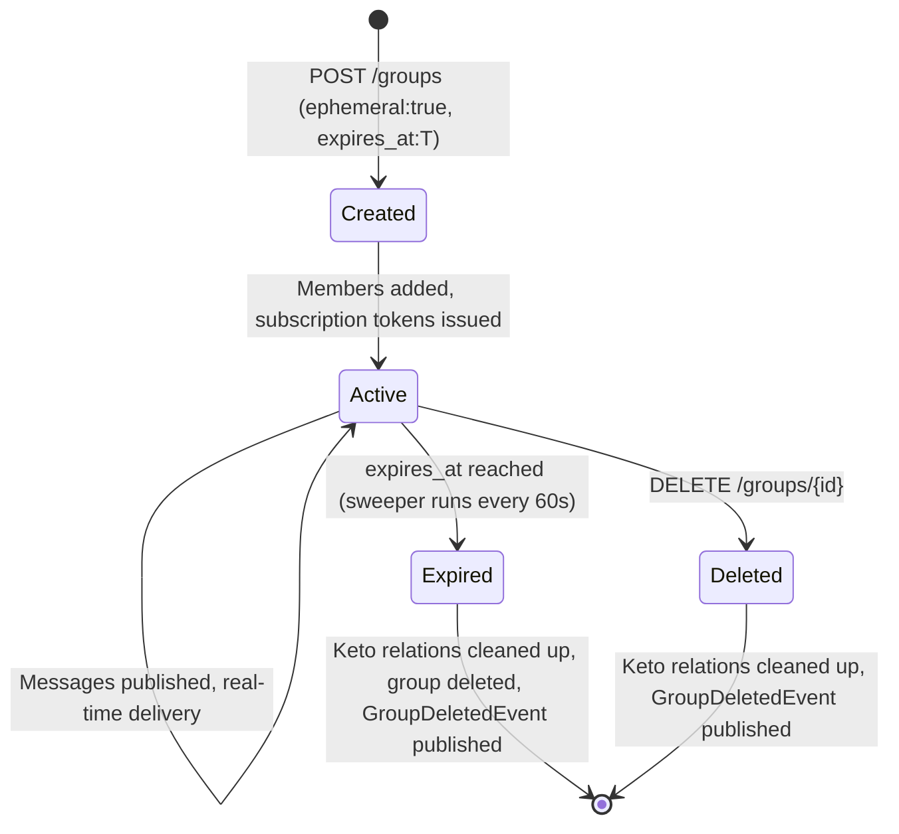

# Groups and Notifications

Mobpilot provides first-class support for both ephemeral groups (short-lived sessions like card games or live events) and permanent groups (teams, communities, channels). Every group supports multi-channel notification delivery: real-time WebSocket/SSE, offline FCM/APNs push, and email.

## Architecture Overview



## Group Types

### Ephemeral Groups

For sessions that have a natural end time: card games, matchmaking lobbies, live Q&A, collaborative editing sessions.

**Key properties:**
- `ephemeral: true`
- `expires_at`: required TTL timestamp
- No Ory Keto relation tuples written — authorization uses **Centrifugo subscription JWTs** instead
- Automatically deleted by the expiry sweeper once TTL passes
- Keto cleanup not needed (no tuples were written)

**Authorization flow (ephemeral):**



### Permanent Groups

For long-lived communities, teams, project channels.

**Key properties:**
- `ephemeral: false` (default)
- No `expires_at`
- Ory Keto relation tuples written on every add/remove: `user member Group:<id>`
- Centrifugo subscription uses **proxy auth** → Keto check

**Authorization flow (permanent):**



## Notification Delivery Flow

When a message is sent to a group, every member receives it through all appropriate channels:



**Online/offline handling:** Centrifugo publish and push are always sent. Mobile apps ignore push notifications while foregrounded. This avoids a synchronous Centrifugo presence check in the critical path.

## Channel Authorization Summary

| Channel namespace | Pattern | Auth mechanism |
|---|---|---|
| `group:` | `group:<groupID>` | Centrifugo proxy → Keto Check (permanent groups) |
| `ephemeral-group:` | `ephemeral-group:<groupID>` | Subscription JWT verify (no Keto call) |
| `user:` | `user:<userID>` | Centrifugo proxy → identity check |

## NATS Subject Design

```
Stream:  MOBPILOT_EVENTS
Filter:  mobpilot.events.>

Subject                                  Event
─────────────────────────────────────────────────────────────
mobpilot.events.org.group.created        GroupCreatedEvent
mobpilot.events.org.group.member_added   MemberAddedToGroupEvent
mobpilot.events.org.group.member_removed MemberRemovedFromGroupEvent
mobpilot.events.org.group.deleted        GroupDeletedEvent
mobpilot.events.org.member.invited       MemberInvitedEvent
mobpilot.events.org.member.joined        MemberJoinedEvent
mobpilot.events.org.organization.created OrgCreatedEvent
```

The notification service subscribes with a durable consumer `notification-processor` filtering `mobpilot.events.org.group.>`.

## Keto Relation Schema

```
Namespace: Group

Relations:
  member  — regular group member
  admin   — can manage membership, delete group

Tuples (permanent groups only):
  subject=<userID>  relation=admin   object=Group:<groupID>   (on CreateGroup)
  subject=<userID>  relation=member  object=Group:<groupID>   (on AddGroupMember)
```

Ephemeral groups do **not** write Keto tuples. At 100K+ concurrent ephemeral sessions, this avoids ~800K Keto write/delete operations per session lifecycle.

## API Reference

### Groups

| Method | Path | Description |
|--------|------|-------------|
| `POST` | `/v1/org/organizations/{orgID}/groups` | Create group (permanent or ephemeral) |
| `GET` | `/v1/org/organizations/{orgID}/groups` | List groups in org |
| `POST` | `/v1/org/groups/{groupID}/members` | Add member to group |
| `GET` | `/v1/org/groups/{groupID}/members` | List group members |
| `DELETE` | `/v1/org/groups/{groupID}/members/{userID}` | Remove member from group |
| `GET` | `/v1/org/centrifugo/token` | Get Centrifugo connection JWT |
| `GET` | `/v1/org/groups/{groupID}/subscription-token` | Get Centrifugo channel subscription JWT (ephemeral groups) |

**Create group request body:**
```json
{
  "name": "Game Session #42",
  "description": "Texas Hold'em, 4 players",
  "ephemeral": true,
  "expires_at": "2026-04-13T14:30:00Z"
}
```

### Notifications

| Method | Path | Description |
|--------|------|-------------|
| `GET` | `/v1/notifications` | List notifications for authenticated user |
| `POST` | `/v1/notifications/{id}/read` | Mark notification as read |
| `GET` | `/v1/notifications/preferences` | Get per-channel preferences |
| `PUT` | `/v1/notifications/preferences/{channel}/{event_type}` | Update preference |

## Ephemeral Group Lifecycle



## Scalability Notes

- **Ephemeral groups at scale:** Zero Keto load. Centrifugo subscription JWTs are verified with HMAC-SHA256 locally. 100K concurrent game sessions = 100K JWT verifications, not 400K+ Keto reads.
- **Permanent groups at scale:** Keto handles permanent memberships. Keto scales horizontally (stateless pods + PostgreSQL). For very large deployments (>1B relation tuples), consider migrating to SpiceDB — the `AuthzPort` interface isolates this change.
- **Fan-out at scale:** Notification service fans out with `errgroup` (concurrency limit 10 per group). For very large groups (>10K members), consider River job queue workers for parallel per-member delivery.
- **NATS JetStream:** File-backed stream with 72h retention. `notification-processor` consumer uses explicit ack with 5 retries and 30s ack wait.
